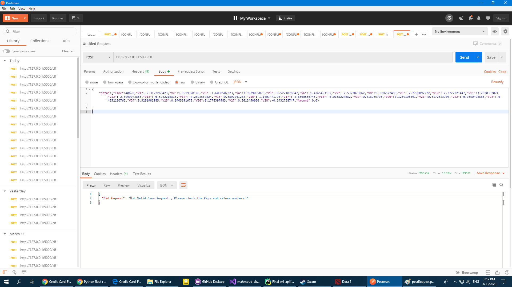
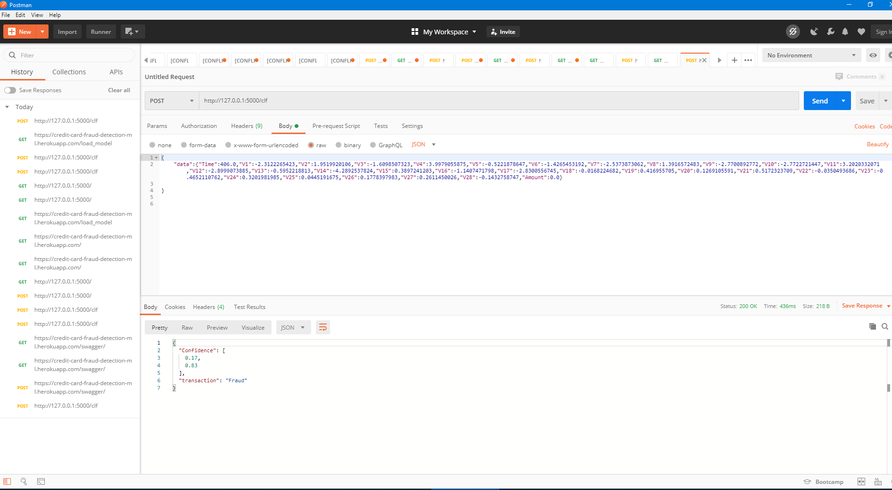
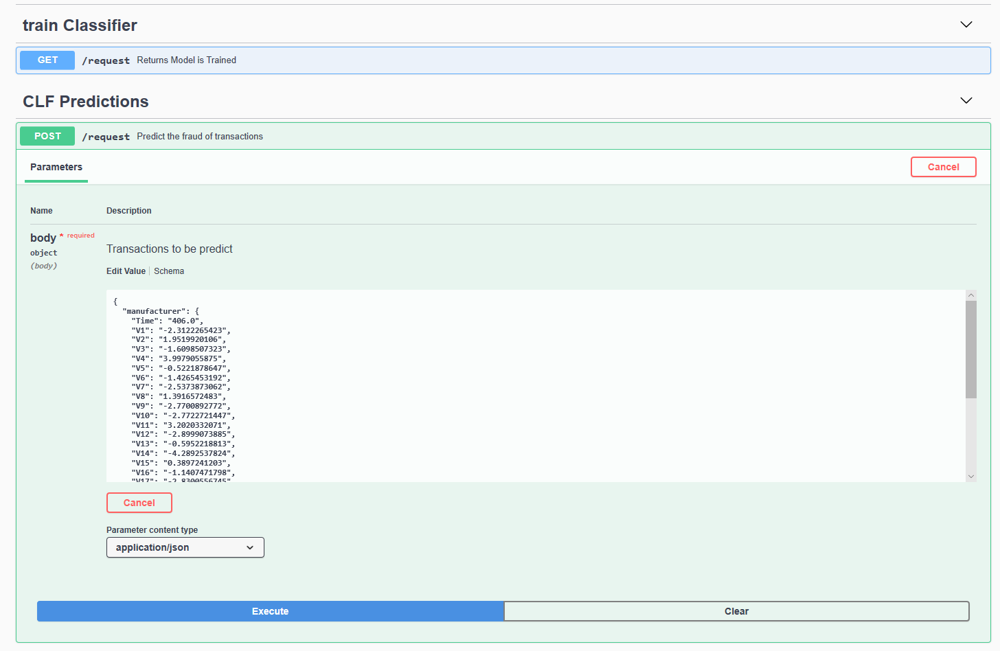

# Credit-Card-Fraud-Detection-ML
Machine learning project to predict if the transactions is Fraud or Valid.

This project will be updated slowly as required, so stay tuned.

If you have a suggestion, or you want to contribute some code, you are free to make a pull request.

Your contributions will be visible since this project is public.

### To Setup and Start

## First go to this link https://www.kaggle.com/mlg-ulb/creditcardfraud and Download the dataset creditcard.csv and put it inside the data folder.

```bash
pip install -r requirements.txt 
python app.py
```

### Welocme o my CLF
```bash
curl -X GET http://127.0.0.1:5000/
```
### Output
```
Welcome to CLF
```

### Train the CLF Model
```bash
curl -X GET http://127.0.0.1:5000/train
```
### Output
```
Model is Trained
```


### Load Clf Model
```bash
curl -X GET http://127.0.0.1:5000/load_model
```
### Output
```
Model is Loaded
```


### Predict Using Our Traind Model
```bash
curl -X POST http://127.0.0.1:5000/clf -H 'Content-Type: application/json' -d '{	
	"data":{"Time":406.0,"V1":-2.3122265423,"V2":1.9519920106,"V3":-1.6098507323,"V4":3.9979055875,"V5":-0.5221878647,"V6":-1.4265453192,"V7":-2.5373873062,"V8":1.3916572483,"V9":-2.7700892772,"V10":-2.7722721447,"V11":3.2020332071,"V12":-2.8999073885,"V13":-0.5952218813,"V14":-4.2892537824,"V15":0.3897241203,"V16":-1.1407471798,"V17":-2.8300556745,"V18":-0.0168224682,"V19":0.416955705,"V20":0.1269105591,"V21":0.5172323709,"V22":-0.0350493686,"V23":-0.4652110762,"V24":0.3201981985,"V25":0.0445191675,"V26":0.1778397983,"V27":0.2611450026,"V28":-0.1432758747,"Amount":0.0}
	
}'
```
### Output
```
{
  "Confidence": [
    "Fraud": 0.83,
    "Valid": 0.17
  ],
  "transaction": "Fraud"
}
```
### confidence have two value 
### first one for valid tranasction propapilty / second for fraud tranasction propapilty

### You Can use these Requestes with Postman 
### Tutrial to lean how to use Postman https://www.youtube.com/watch?v=t5n07Ybz7yI
### Example of Bad Request

### Example of Working Request



## Swagger UI


## Swagger UI Hosted Locally
http://127.0.0.1:5000/swagger/


## Hosted via Heroku
https://card-fraud.herokuapp.com/

## Swagger UI Live on Heroku
https://card-fraud.herokuapp.com/swagger/

### Live Prediction on Heroku using Our Traind Model
```bash
curl -X POST https://card-fraud.herokuapp.com/clf -H 'Content-Type: application/json' -d '{	
	"data":{"Time":406.0,"V1":-2.3122265423,"V2":1.9519920106,"V3":-1.6098507323,"V4":3.9979055875,"V5":-0.5221878647,"V6":-1.4265453192,"V7":-2.5373873062,"V8":1.3916572483,"V9":-2.7700892772,"V10":-2.7722721447,"V11":3.2020332071,"V12":-2.8999073885,"V13":-0.5952218813,"V14":-4.2892537824,"V15":0.3897241203,"V16":-1.1407471798,"V17":-2.8300556745,"V18":-0.0168224682,"V19":0.416955705,"V20":0.1269105591,"V21":0.5172323709,"V22":-0.0350493686,"V23":-0.4652110762,"V24":0.3201981985,"V25":0.0445191675,"V26":0.1778397983,"V27":0.2611450026,"V28":-0.1432758747,"Amount":0.0}
	
}'
```
### Output from heroku
```
{
  "Confidence": [
    "Fraud": 0.83,
    "Valid": 0.17
  ],
  "transaction": "Fraud"
}
```


### Use the above curl commands replacing `http://127.0.0.1:5000` with `https://card-fraud.herokuapp.com/`

# Jupyter Notebook'Trianed Model with Random Forset'
# Credit Card Fraud Detection.ipynb


# Meduim Blog: https://medium.com/@santana11santana/credit-card-fraud-detection-using-random-forest-eb689237ec2c
